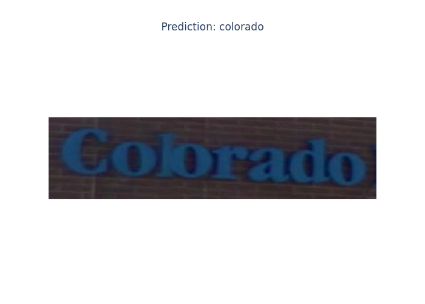
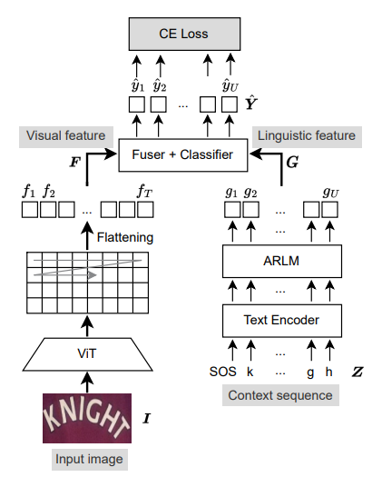

# <center>ViTSTR-Transducer implementation for text recognition</center>

<details>

  <summary><b>Test set examples</b> (clickable spoiler)</summary>
  

  
  
  
  
  
  
  
  
  
  
</details>

<b>More [here](./imgs/examples)</b>

Datasets used for training, validation and testing can be found [<b>here</b>](https://github.com/clovaai/deep-text-recognition-benchmark) ([direct link to DropBox](https://www.dropbox.com/scl/fo/zf04eicju8vbo4s6wobpq/ALAXXq2iwR6wKJyaybRmHiI?rlkey=2rywtkyuz67b20hk58zkfhh2r&e=1&dl=0))

## Architecture


## Prerequisites:  
  - ***Python* 3.12.x**
  - ***CUDA* 12.6.x**
  - ***cuDNN* 9.10.x**
  - ***PyTorch* 2.7.0**
  - ***TorchVision* 0.22.0**
  - (optional) ***Docker*** + ***NVIDIA Container Toolkit***
  - (optional) ***ClearML***

## Inference using pretrained weights
1. Install dependencies from `requirements.txt` or *Conda* environment from `environment.yml`
2. Download weights from [releases page](https://github.com/ScReameer/ViTSTR-Transducer/releases)
3. Follow steps on [example notebook](./inference_example.ipynb)


## Train on your own data
### Dataset
Datasets can be in two different formats:
* <b>LMDB</b>

  The structure should be approximately as follows:
  ```bash
  ├── test
  │   ├── CUTE80
  │   │   ├── data.mdb
  │   │   └── lock.mdb
  │   ├── IC03_860
  │   │   ├── data.mdb
  │   │   └── lock.mdb
  │   ├── IC03_867
  │   │   ├── data.mdb
  │   │   └── lock.mdb
  │  ...
  ├── train
  │   ├── MJ
  │   │   ├── data.mdb
  │   │   └── lock.mdb
  │   └── ST
  │       ├── data.mdb
  │       └── lock.mdb
  └── val
      ├── MJ_valid
      │   ├── data.mdb
      │   └── lock.mdb
      └── extra_val
          ├── data.mdb
          └── lock.mdb
  ```
  More about lmdb internal structure can be found in [`LmdbDataset.__getitem__`](./src/data/lmdb_dataset.py)

* <b>JSON</b>

  ```bash
  ├── test
  │   ├── ann
  │   │   └── 1.json
  │   └── img
  │   │   └── 1.png
  ├── train
  │   ├── ann
  │   │   └── 2.json
  │   └── img
  │   │   └── 2.jpg
  └── val
      ├── ann
          └── 3.json
      └── img
          └── 3.jpeg
  ```
    
  JSON file must contain 2 fields: `description` (**real target**) and `name` (**image filename without extension**)
  ```json
  {"description": "kioto", "name": "2"}
  ```
  >`kioto` is real target (what should be recognized by model) and `2` is image filename without extension, which could be `2.jpg` or `2.png` etc.

### Configuration
Main configuration file is `configs/config.yaml`. You can modify it to suit your needs. Almost all field have comments to help you understand what they do.

>**NOTE 1: `LABELS` is case sensitive**. If you want to train a model that can determine the case of the text, you need to include both lowercase and uppercase labels. Example: `aAbBcC...` for case sensitive training and `abc...` for case insensitive training.

>**NOTE 2: If you use *Docker* don't change the `DATASET_PATH` in `config.yaml`**. This path is used inside the *Docker* container and it's not accessible from your host machine.

>**NOTE 3: Training results will be saved in the `outputs` directory for both local and *Docker* training.**

### Local training
1. Install dependencies from `requirements.txt` or *Conda* environment from `environment.yml`
2. Change `DATASET_PATH` in `config.yaml` to point to your dataset
3. Change `DATASET_TYPE` in `config.yaml` to match your dataset type (`lmdb` or `json`)
4. Run the script:
    ```bash
    python main.py --config=./configs/config.yaml --output-dir=outputs --device=0
    ```

### Training with *Docker*
1. Change `DATASET_PATH` in `.env` to point to your dataset
2. Change `DATASET_TYPE` in `config.yaml` to match your dataset type (`lmdb` or `json`)
3. Build and run the *Docker* container:
    ```bash
    source .env && docker compose build && docker compose run vitstr
    ```

## References
[ViTSTR-Transducer: Cross-Attention-Free Vision Transformer Transducer for Scene Text Recognition](https://www.mdpi.com/2313-433X/9/12/276)

[Text recognition (optical character recognition) with deep learning methods, ICCV 2019](https://github.com/clovaai/deep-text-recognition-benchmark)

[Vision Transformer for Fast and Efficient Scene Text Recognition](https://github.com/roatienza/deep-text-recognition-benchmark)